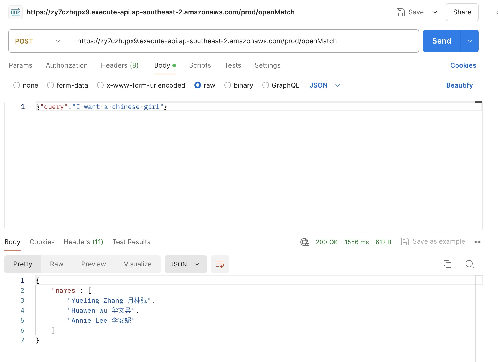
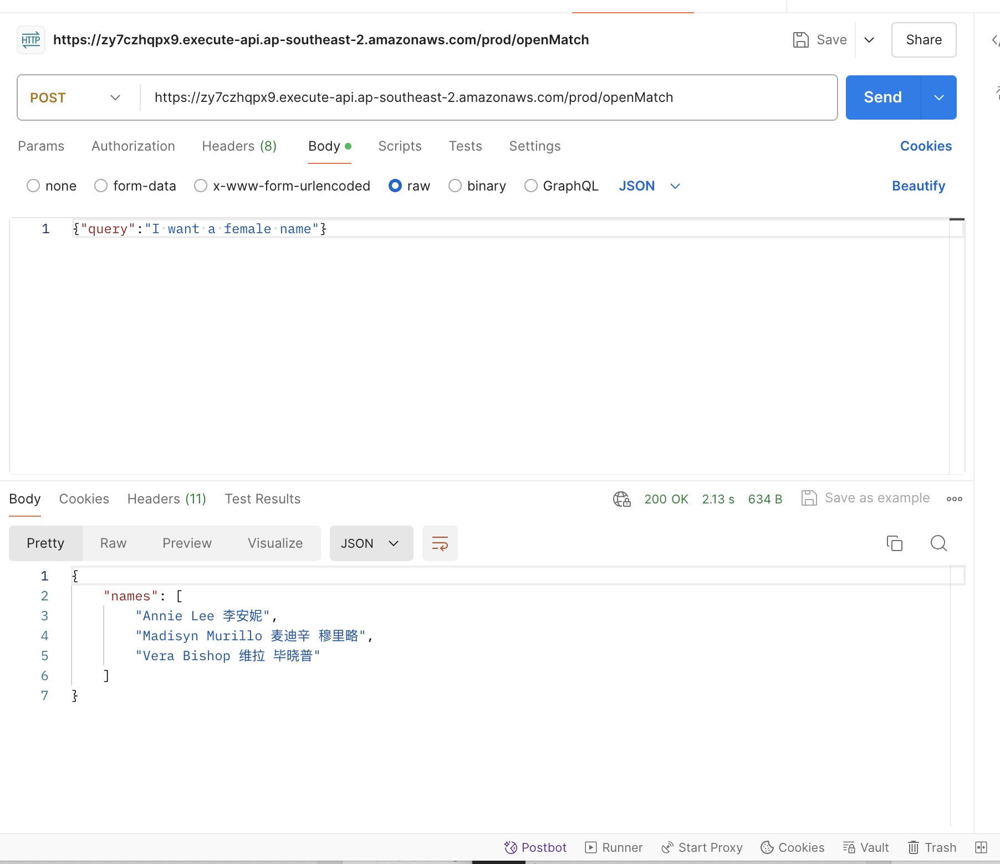

# ApiEndpoint

## Name Match

https://5mtd8ee5li.execute-api.ap-southeast-2.amazonaws.com/prod/exactMatch

### Postman test

Method: POST
body: {person: "华文吴"}

### Open query on Names

https://zy7czhqpx9.execute-api.ap-southeast-2.amazonaws.com/prod/openMatch

### Postman test

Method: POST
body: {"query": "I am looking for a chinese girl."}

## Name Matching Lambda Function

This project provides an AWS Lambda function written in TypeScript to match a human name from a given list of names using OpenAI's GPT-3.5-turbo model.

## Goals

- Develop an AWS Lambda function that matches a human name in a list of names.
- Ensure the function returns the best-matched name consistently.

## Features

- Name matching using OpenAI's GPT-3.5-turbo.
- Few shot training for naming matching task.
- Carefully designed prompt.
- Error handling and retries for OpenAI API calls.
- Post Validation of OpenAI responses against the provided list of names.

# OpenQuery - Handle any question on people collection

### Example queries:

I want a chinese girl.

I want a female name.

I want a peoson whose first name is Pierce

